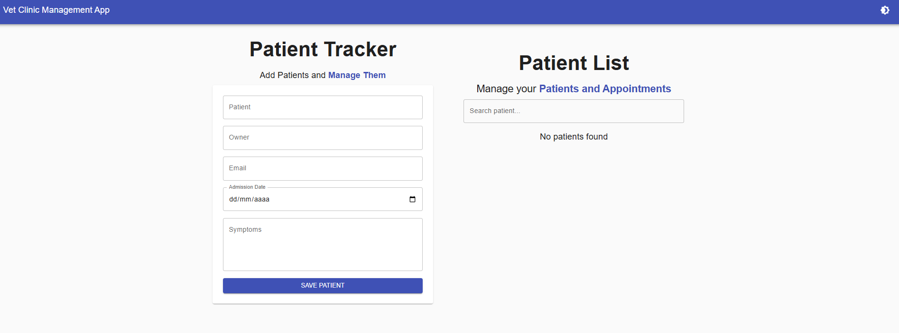
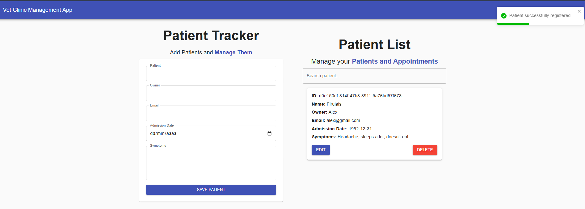
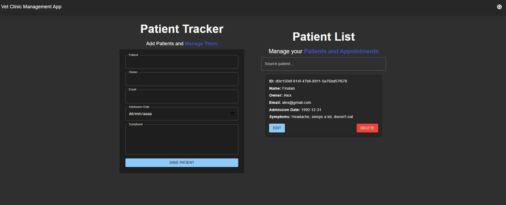

# 🐾 Vet Clinic Management App

A modern React-based application to manage veterinary patients, built with
**TypeScript**, **Material UI**, **Zustand**, and **React Hook Form**.

This project simulates a real-world clinic dashboard where users can **add,
update, delete, and visualize patients' information**, making it a practical and
relevant solution for small veterinary clinics or educational purposes.

### 📸 Screenshots

 


## 🚀 Features

- 📋 Patient form with validation and edit mode.
- 🧑‍⚕️ Real-time state management with Zustand.
- 🌙 Light/Dark theme toggle with localStorage persistence.
- 📊 Patient analytics with monthly registration charts.
- 📬 Email validation and responsive Material UI form design.
- 🧼 Clean UX with confirmation modals and toast notifications.

## 🛠️ Built With

- [React + TypeScript](https://reactjs.org/)
- [Vite](https://vitejs.dev/) — for fast build and dev experience
- [Material UI](https://mui.com/) — responsive UI components
- [Zustand](https://github.com/pmndrs/zustand) — minimal state management
- [React Hook Form](https://react-hook-form.com/) — for form validation
- [React Toastify](https://fkhadra.github.io/react-toastify/) — notifications
- [Recharts](https://recharts.org/en-US/) — charts

## 📁 Project Structure

├── public/ │ └── screen1.png, screen2.png, screen3.png ├── src/ │ ├──
components/ # UI components │ ├── types/ # TypeScript interfaces │ ├──
theme.ts # Custom Material UI themes │ ├── store.ts # Zustand state management │
└── App.tsx # Main app layout

## 📦 Installation

```bash
# Clone the repo
git clone https://github.com/guillevarelabarros/vet-clinic-app.git
cd vet-clinic-app

# Install dependencies
yarn

# Run the development server
yarn dev

🧪 Run Production Build

yarn build


🧠 Why This Project Matters
This project shows my ability to:

Build real-world UI with Material UI.

Use Zustand for scalable and maintainable state logic.

Implement form validation with React Hook Form.

Handle dark/light themes and persist settings.

Create reusable components with TypeScript.

Structure a frontend project in a clean, modular way.

👨‍💻 Author

Guillermo Ignacio Varela Barros
Front-End Developer — Argentina 🇦🇷
GitHub: @guillevarelabarros

Made with ❤️ and a lot of React
```
